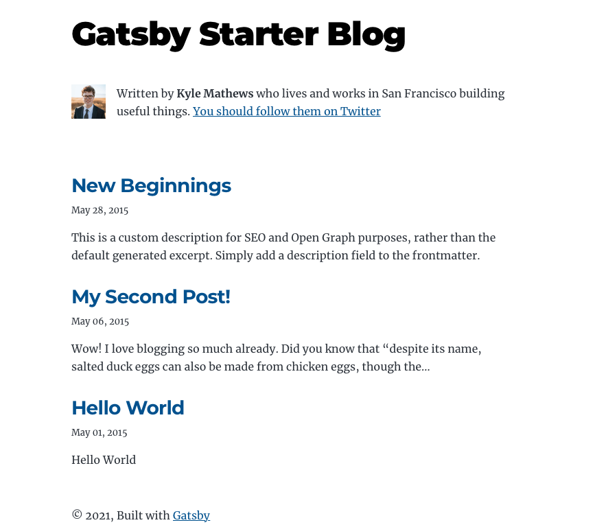
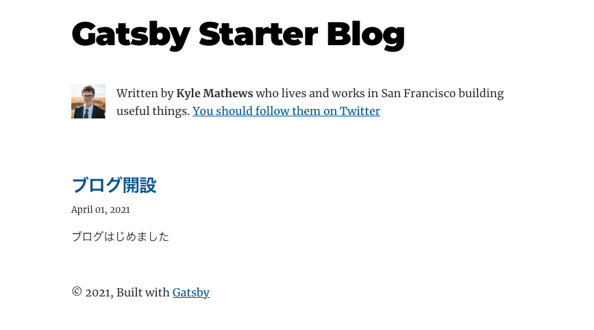

このサイトは gatsby-starter-blog を利用して構築した。
インストールして起動して、必要な箇所を変更しただけだけど何やったかを残しておく。

## 環境

開発マシンは macOS Catalina。

## 準備

### node インストール

ローカルの node はバージョン管理の nodenv を利用している。
amplify のビルド環境が Node.js 12 っぽかったのでローカル環境も合わせて現在の Node.js 12 の最新バージョンをインストール。

```
nodenv install 12.21.0
nodenv local 12.21.0
```

### gatsby インストール

```
npm install -g gatsby-cli
```

## サイト作成

### テンプレートからプロジェクト作成#

```
gatsby new www.elmoelmo.blog https://github.com/gatsbyjs/gatsby-starter-blog
```

### 起動

```
yarn run develop

yarn run v1.22.10
$ gatsby develop
success open and validate gatsby-configs - 0.065s
success load plugins - 1.795s
success onPreInit - 0.031s
success initialize cache - 0.008s
success copy gatsby files - 0.148s
success onPreBootstrap - 0.015s
success createSchemaCustomization - 0.144s
success Checking for changed pages - 0.001s
success source and transform nodes - 0.091s
success building schema - 0.351s
info Total nodes: 62, SitePage nodes: 4 (use --verbose for breakdown)
success createPages - 0.038s
success Checking for changed pages - 0.001s
success createPagesStatefully - 0.060s
success update schema - 0.048s
success write out redirect data - 0.001s
success Build manifest and related icons - 0.112s
success onPostBootstrap - 0.119s
info bootstrap finished - 5.967s
success onPreExtractQueries - 0.001s
success extract queries from components - 1.194s
success write out requires - 0.005s
success run static queries - 0.016s - 2/2 122.51/s
warn code block or inline code language not specified in markdown. applying generic code block
success run page queries - 0.210s - 3/3 14.30/s
⠀
You can now view gatsby-starter-blog in the browser.
⠀
  http://localhost:8000/
⠀
View GraphiQL, an in-browser IDE, to explore your site's data and schema
⠀
  http://localhost:8000/___graphql
⠀
Note that the development build is not optimized.
To create a production build, use gatsby build
⠀
success Building development bundle - 11.411s
```

### アクセス

Web ブラウザを起動して `http://localhost:8000/` にアクセスする。



ブログサイトが起動しました。

### 記事削除・作成

ブログ記事は `/content/blog/` 配下にある。
デフォルトの記事を作成して新たに追加する。

```
rm -r ./content/blog/*
mkdir ./content/blog/initial-blog
echo '---
title: ブログ開設
date: "2021-04-01T12:00:05Z"
description: ブログはじめました
---

ブログ本文です。
ブログはじめました。
' > ./content/blog/initial-blog/index.md
```

### 再度アクセス

Web ブラウザに戻ってページをリロードする。



## まとめ

簡単にブログサイトを生成できた。
次回は AWS Amplify でデプロイして公開する。
