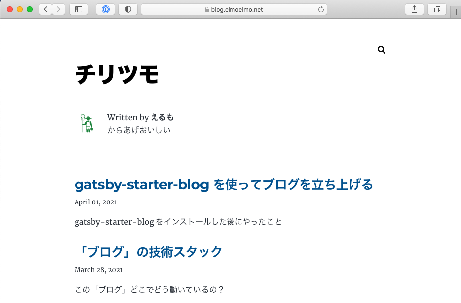

ブログを公開する。
今回は AWS Amplify Console を使って CI/CD、ホスティングする。

Amplify 自体は多くの機能を持つのですが、今回は CI/CD、ホスティングの Amplify Console のみを利用する。
AWS だけでも CI/CD、ホスティングの選択肢は多くあるが、Amplify Console を利用すると Amplify だけで完結できるので設定や管理が楽だ。

マネージドコンソールからポチポチ設定しても簡単だけど CDK に慣れるために CDK で設定する。

## CDK プロジェクト追加

前回作った gatsby のプロジェクトに CDK の設定を追加していく。

```
mkdir cdk
cd cdk
cdk init app --language typescript
```

テンプレートには `app` を指定する。
言語は Typescript を選択する。 Typescript で開発したことないけど CDK は Typescript が絶対いい。vscode など IDE 使うとホント楽。

## Amplify モジュールインストール

```
yarn add @aws-cdk/aws-amplify
```

## GitHub Personal Access Token の払い出し

GitHub Personal Access Token を Amplify App に適用することで Amplify と GitHub を連携できる。
GitHub Personal Access Token の払い出しは以下の手順で。
なお、この Token は割り当てた権限（今回はリポジトリ権限） の GitHub 操作ができるので絶対に他人が読めてはいけない。
くれぐれも GitHub などで管理しないようにしよう。

https://docs.github.com/en/github/authenticating-to-github/creating-a-personal-access-token

今回は Secrets Manager に登録し、CDK （CloudFormation）で Secrets Manager から読み取ることができる。

## CDK 書く

##### cdk/lib/elmoelmo-blog-stack.ts

```
import * as cdk from '@aws-cdk/core';
import * as amplify from '@aws-cdk/aws-amplify';

export class ElmoelmoBlogStack extends cdk.Stack {
  constructor(scope: cdk.Construct, id: string, props?: cdk.StackProps) {
    super(scope, id, props);

    const amplifyApp = new amplify.App(this, "elmoelmo-blog-app", {
      sourceCodeProvider: new amplify.GitHubSourceCodeProvider({
        owner: "s-fujimoto",
        repository: "blog.elmoelmo.net",
        oauthToken: cdk.SecretValue.secretsManager("prod/blog.elmoelmo.net/amplify", {
          jsonField: "GITHUB_OAUTH_TOKEN",
        }),
      }),
    });
    const masterBranch = amplifyApp.addBranch("master");

    // amplifyApp.addDomain("elmoelmo.net", {
    //   subDomains: [
    //     {
    //       branch: masterBranch,
    //       prefix: "blog"
    //     }
    //   ]
    // })
  }
}
```

※ Domain はデプロイに失敗したので手動で設定した。ドメインが not found。

## CDK デプロイ

```
cdk deploy
```

Amplify App が作られるとそのままビルドが動作し、待てば公開される。

## 動作確認

Web ブラウザを起動し、登録したドメインの URL にアクセスする。
今回であれば `https://blog.elmoelmo.net/` にアクセスする。


