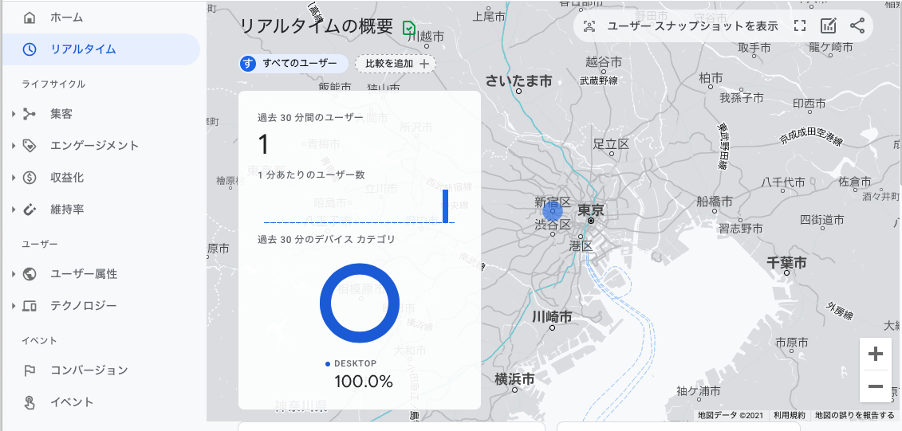

Algolia で検索系の計測はできますがブログ自体のアクセス解析を導入する。
また Google Analytics で検索計測の方法を学びたいので検索を計測する設定を入れてみる。

検索の計測はいくつかの目的がある。どこまでできるか

## 検索キーワード分析
* 「何の」キーワードが「どのくらい」検索されているか
  * 流入検索は GA デフォルトで取得できるが今回は「サイト内検索」にフォーカスする
* 検索キーワードを知ることでユーザーの需要を把握できる

## 検索キーワードに対するヒット件数
* 主に 0件ヒットの有無
* 0件ヒットの有無を知ることでユーザーの需要に対して応えられているかを把握できる
  * 需要に対するコンテンツが品揃えとしてあるのか
  * 需要に対する検索キーワードをコンテンツに含めているのか

## コンバージョン
* 検索後にページ閲覧したかどうか
* 検索後に閲覧したかどうかでユーザーの需要に対して応えられているかを把握できる
  * 上と同じだが若干異なる観点で分析できる
  * ノイズとなる検索結果が多いのではないか
  * 正しいソートで返していないのではないか

# セットアップ

セットアップは以下の手順になる

* Google Analytics のプロパティ設定
* Google Tag Manager のコンテナ設定
* gatsby-plugin-google-tagmanager の設定

## Google Analytics のプロパティ設定

https://support.google.com/analytics/answer/9304153

## Google Tag Manager のコンテナ設定

https://support.google.com/tagmanager/answer/9442095

## gatsby-plugin-google-tagmanager の設定

Gatsby の Google Tag Manager のプラグインが用意されているので利用する。

https://www.gatsbyjs.com/plugins/gatsby-plugin-google-tagmanager/

### プラグインインストール

```
yarn add gatsby-plugin-google-tagmanager
```

### プラグイン設定

インストールしたプラグインの利用とIDを設定する。

##### gatsby-config.js

Tag Manager の ID が必要なので設定した Google Tag Manager のページからコピペする。

```
    {
      resolve: "gatsby-plugin-google-tagmanager",
      options: {
        id: "YOUR_GOOGLE_TAGMANAGER_ID",
      },
    },
```

# デプロイ

設定したらデプロイ。

# 動作確認

デプロイが完了したらブログへアクセスし、Google Analytics のリアルタイムを確認すると、アクセスの計測を確認できた



# まとめ

Gatsby を利用すると Google Analytics の導入は簡単。
検索の測定はまた別の機会に。
