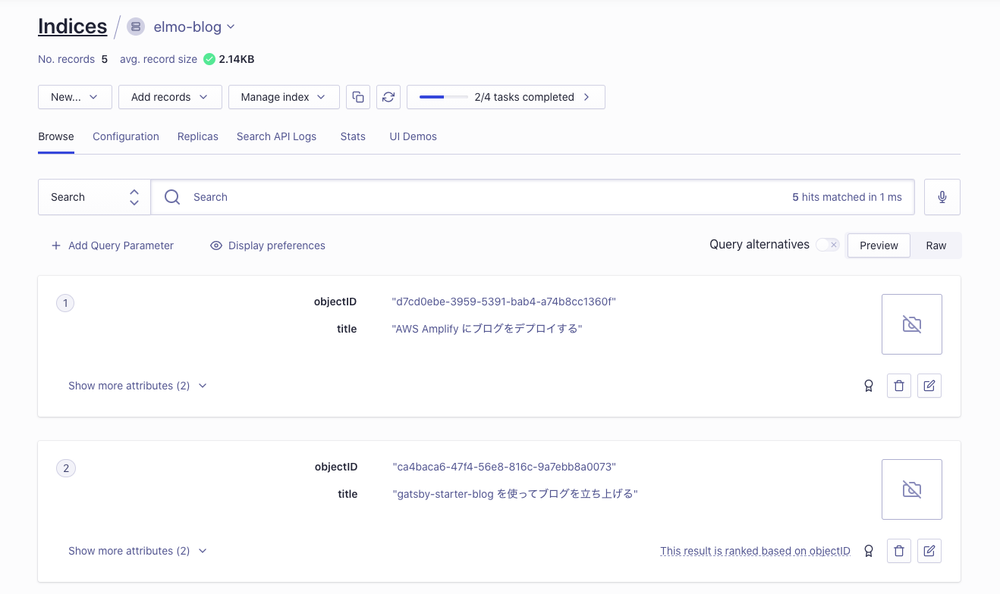
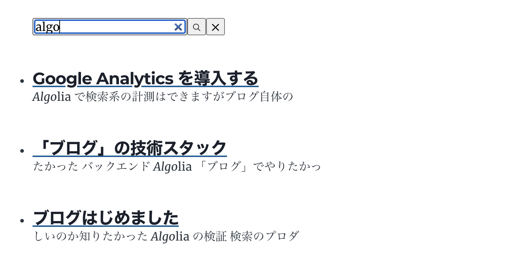

前回の記事でブログを公開できた。

今回はこのブログを作った大きな目的の Algolia を組み込んでいく。

## Algolia とは

Algolia は検索エンジンのみならず検索に必要な機能のオールインな SaaS。

https://www.algolia.com/

多くの強みがある。

- 高速な検索レスポンス
- UI 用のライブラリ提供
- エコシステムとの連携
- クローラ
- 行動分析
- 検索精度をチューニングできる管理画面

### 他の検索エンジンと比べて

私は検索エンジンには Elasticsearch の利用経験がある。
Elasticsearch は Elastic Cloud という Elasticsearch as a Service がある。
上に書いた強みは Elastic Cloud と比べた強み。

Elastic Cloud はあくまでも Elasticsearch のマネージドサービスだ。
システムの検索機能を実装するだけであれば Elasticsearch の導入はそんなにハードル高くないが、
システムの検索機能を運用、育てていくとなると独自で頑張らないといけないことが多い。

Algolia はそれらもリーチできているのが何よりも強みだと思っている。

## Gatsby と Algolia

強みに書いたように Algolia は UI ライブラリの提供やエコシステムとの連携などとにかく既存のシステムに組み込むハードルが低い。

Gatsby との連携も簡単。Gatsby のブログテンプレートを利用しつつ、Algolia とインテグレーションすることが非常に簡単だ。

- Gatsby plugin Algolia
  - https://github.com/algolia/gatsby-plugin-algolia
  - https://www.gatsbyjs.com/docs/adding-search-with-algolia/
  - Build 時にコンテンツを Algolia にインデキシングできる
- React InstantSearch
  - https://github.com/algolia/react-instantsearch
  - https://www.algolia.com/doc/api-reference/widgets/react/
  - React Component を利用するだけ UI、サジェスト、検索を実装できる

## Algolia アカウント開設

Algolia のアカウント開設はとにかく簡単。
私は今回 GitHub アカウントと連携してサインアップした。
Free プランで利用する場合、支払い情報も不要。

### Algolia の利用料金

Algolia は月の検索リクエスト数＋レコード数が 10,000 まで（正確には 1,000/unit の 10unit）は Free プランで使える。
小さいサイトではほぼ無償で利用できる。

## インデックス作成

Algolia でやっておくことはインデックスとを作成しておくことのみ。

左メニューの「Indices」から「Create Index」をクリックする。
インデックス名を入力するだけ。

またインデックスは言語を設定する。
「Configuration」タブから「Language」を選択する。
ブログは日本語なので「Index Language」、「Query Language」ともに「日本語」を選択する。
選択した Language によって適切なストップワード排除、語幹化が動作し、検索精度を向上できる。

## Gatsby Plugin によるコンテンツの自動インデキシング

以下の記事を実施すればできた。

https://www.gatsbyjs.com/docs/adding-search-with-algolia/

### プラグインインストール

```
yarn add gatsby-plugin-algolia
```

### Algolia のアクセス情報取得

アプリケーション ID、検索 API キー、Admin API キーを Algolia の管理コンソールから取得する。Admin API キーはデータ登録などできるので他者が読み取れないようにすること。
たとえば、パブリックな GitHub リポジトリやビルド生成物に含めないこと。

私はローカル開発用には direnv（.gitignore に登録）。
Amplify のビルド用には Amplify の Environment Variables に登録した（平文なのでよくない）。

取得したアクセス情報を以下の環境変数キーにセットする。

```
GATSBY_ALGOLIA_APP_ID=<App ID>
GATSBY_ALGOLIA_SEARCH_KEY=<Search-Only API Key>
ALGOLIA_ADMIN_KEY=<Admin API Key>
```

### インデキシング実装

プラグインで利用する実装を書く。今回はドキュメントの実装をそのまま利用。

https://www.gatsbyjs.com/docs/adding-search-with-algolia/#query-the-pages-for-indexing

`indexName` は作成したインデックスの名前に変更する。

```
const escapeStringRegexp = require("escape-string-regexp")
const pagePath = `content`
const indexName = `elmo-blog`
...
```

### ビルド設定

インストールしたプラグインを `gatsby-config.js` に登録する。
アクセス情報はビルド環境の環境変数にセットして参照することでソースコードには埋め込まないようにした。

```
  plugins: [
    {
      resolve: `gatsby-plugin-algolia`,
      options: {
        appId: process.env.GATSBY_ALGOLIA_APP_ID,
        apiKey: process.env.ALGOLIA_ADMIN_KEY,
        queries: require("./src/utils/algolia-queries")
      },
    },
```

### 動作確認

ローカル環境で動作確認する。
環境変数にアクセス情報をセットした上でビルドを実行する。

```
yarn run build

...
success index to Algolia - 2.047s - Done!
...
```

ビルド処理に Algolia へのインデキシングが実行されている。

次に Algolia のデータを見てみる。



コンテンツの情報が登録されているのを確認できた。

## 検索 UI 実装

次にブログに検索 UI を実装する。

https://www.gatsbyjs.com/docs/adding-search-with-algolia/#adding-the-user-interface

このドキュメントでは検索窓、検索窓にキーワードを入力すると検索結果を表示する（インクリメンタルサーチ） UI を実装する。

実装方法は手順通りでできるので割愛する。

ここでは React InstantSearch が提供する Component や機能を軽く記載する。
ちなみに私はフロントエンド開発未経験なので説明に自信ない。

### [InstantSearch](https://www.algolia.com/doc/api-reference/widgets/instantsearch/react/)

React InstantSearch の検索や検索結果表示などの Component を利用する時の Root Component。
検索するインデックスや API Key などを保持する。

### [SearchBox](https://www.algolia.com/doc/api-reference/widgets/search-box/react/)

検索 UI 用の Component。デフォルトでインクリメンタルサーチが有効になっている。

#### [connectSearchBox](https://www.algolia.com/doc/api-reference/widgets/search-box/react/#connector)

UI を変更したい場合、 HOC を利用する。
ドキュメントによる本実装も HOC を利用して独自 UI の検索ボックスを実装している。

### [Hits](https://www.algolia.com/doc/api-reference/widgets/hits/react/)

検索結果を受け取る Component。

### 実装例

これらを組み合わせることで非常に少ない実装で検索ボックス、インクリメンタルサーチ、algolia への検索 API、検索結果の表示を実現できる。

```
  const [query, setQuery] = useState()

  return (
    <InstantSearch
      searchClient=algoliasearch(appId, apiKey)
      indexName=indexName
      onSearchStateChange={({ query }) => setQuery(query)}
    >
      <SearchBox />
      {query?
      <Hits hitComponent={({ hit }) => <div>
        <Link to={hit.slug}>
          <h4>{hit.title}</h4>
        </Link>
        <Snippet attribute="excerpt" hit={hit} />
      </div>} />
      : null
      }
    </InstantSearch>
  )
```



# まとめ

Algolia が提供する Gatsby プラグイン、React InstantSearch を利用することで少ない実装でビルドプロセスでのインデキシング、検索 UI を作れた。
InstantSearch は React 以外のフレームワーク、Javascript 以外の言語も提供されている。継続的なメンテナンスが期待できる公式によるライブラリ提供は非常に嬉しい。
