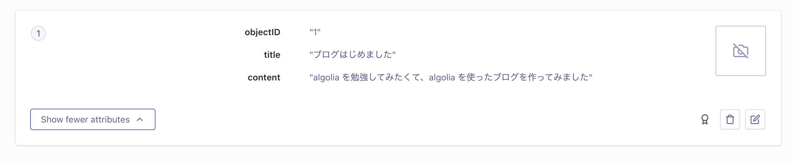
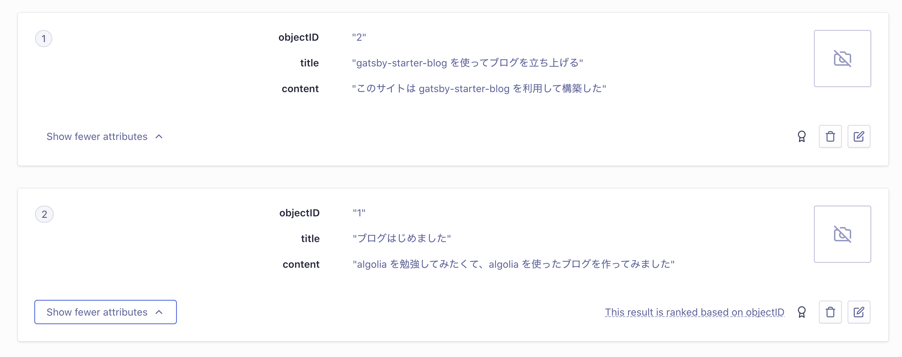

ブログサイトを作成し、gatsby のプラグインや react-instantsearch を通して Algolia のデータ操作できた。
もう少し理解を深めるためにシェルで直接 API 操作してどんな操作ができるのか理解する。

Algolia は公式のクライアントライブラリ、 3rd パーティ連携が充実しているので REST API を直接叩くことはない。
けど個人的に何かしらの API サーバを利用する時は直接 API 叩いて理解するようにしている。

# REST API のリファレンス

https://www.algolia.com/doc/rest-api/search/

# Algolia REST API の基本

REST API 操作の前に REST API に利用する情報を整理する。

- Application ID
- API Key
- Index name

## ドメイン

ドメインは Appllication ID をホスト名に利用する。

https://{Application ID}.algolia.net

## URL パス

利用用途で URL、Verb が変わる。
検索やインデキシングは URL パスに Index name を利用する。

## ヘッダ

HTTP ヘッダに認証情報を指定する。

X-Algolia-Application-Id: {Application ID}
X-Algolia-API-Key: {API Key}

## 基本 API（curl 形式）

```
curl \
    -H"X-Algolia-Application-Id: ${APPLICATION_ID}" \
    -H"X-Algolia-API-Key: ${API_KEY}" \
    -X${VERB} \
    https://${APPLICATION_ID}.algolia.net/${PATH} \
    -d"${JSON_DATA}"
```

# 準備

## テストインデックス作成

テスト用にデータ操作するインデックスを作成する。
このあたりは画面操作で。

日本語の検索の挙動も見てみたかったのでインデックスは日本語設定する。

## API Key の払い出し

テスト用に利用する API Key は分けたかったので API Key を作成した。
権限は minimal にした。
テストインデックスに `search`、`addObject`、`deleteObject` 権限を付与。

# Add Object

それではデータ登録してみる。

URL パスは `1/indexes/{index name}/{object id}`。
index name は作成したインデックスの名前、object id はインデックス内で一意となるオブジェクトを識別する文字列。

リクエストボディはオブジェクトのデータ。
Algolia のオブジェクトは JSON 形式。

- リクエスト

```
curl \
    -H"X-Algolia-Application-Id: ${APPLICATION_ID}" \
    -H"X-Algolia-API-Key: ${API_KEY}" \
    -XPUT \
    "https://${APPLICATION_ID}.algolia.net/1/indexes/${INDEX}/1" \
    -d'{
      "title": "ブログはじめました",
      "content": "algolia を勉強してみたくて、algolia を使ったブログを作ってみました"
    }'
```

- レスポンス

```
{
  "updatedAt":"2021-08-22T01:32:46.252Z",
  "taskID":730183175001,
  "objectID":"1"
}
```

Algolia の UI でデータが登録されているか確認してみる。



Add Object の詳細は以下のリファレンスを参照。

https://www.algolia.com/doc/rest-api/search/#addupdate-object-with-id

## Batch write operations

オブジェクトを追加・更新・削除する際に一件ずつ API を発行すると効率が悪いため、
複数件操作する場合は Batch write operations を利用する。

- リクエスト

```
curl \
    -H"X-Algolia-Application-Id: ${APPLICATION_ID}" \
    -H"X-Algolia-API-Key: ${API_KEY}" \
    -XPOST \
    "https://${APPLICATION_ID}.algolia.net/1/indexes/${INDEX}/batch" \
    -d'{
      "requests": [
        {
          "action": "addObject",
          "body": {
            "objectID": "1",
            "title": "ブログはじめました",
            "content": "algolia を勉強してみたくて、algolia を使ったブログを作ってみました"
          }
        },
        {
          "action": "addObject",
          "body": {
            "objectID": "2",
            "title": "gatsby-starter-blog を使ってブログを立ち上げる",
            "content": "このサイトは gatsby-starter-blog を利用して構築した"
          }
        }
      ]
    }'
```

- レスポンス

```
{
  "objectIDs":["1", "2"],
  "taskID":738975247000
}
```

Algolia の UI でデータが登録されているか確認してみる。



Batch write operations の詳細は以下のリファレンスを参照。

https://www.algolia.com/doc/rest-api/search/#addupdate-object-with-id

# 検索

登録したオブジェクトを検索する。

URL パスは `1/indexes/{index name}/query`。
index name は作成したインデックスの名前。

リクエストボディは検索条件。
Algolia のオブジェクトは JSON 形式。

- リクエスト

```
curl \
    -H"X-Algolia-Application-Id: ${APPLICATION_ID}" \
    -H"X-Algolia-API-Key: ${API_KEY}" \
    -XPOST \
    "https://${APPLICATION_ID}.algolia.net/1/indexes/${INDEX}/query" \
    -d'{
      "params": "query=ブログ"
    }'
```

- レスポンス

```
{
  "hits": [
    {
      "title": "ブログはじめました",
      "content": "algolia を勉強してみたくて、algolia を使ったブログを作ってみました",
      "objectID": "1",
      "_highlightResult": {
        "title": {
          "value": "<em>ブログ</em>はじめました",
          "matchLevel": "full",
          "fullyHighlighted": false,
          "matchedWords": [
            "ブログ"
          ]
        },
        "content": {
          "value": "algolia を勉強してみたくて、algolia を使った<em>ブログ</em>を作ってみました",
          "matchLevel": "full",
          "fullyHighlighted": false,
          "matchedWords": [
            "ブログ"
          ]
        }
      }
    },
    ...
  ],
  "nbHits": 2,
  "page": 0,
  "nbPages": 1,
  "hitsPerPage": 20,
  "exhaustiveNbHits": true,
  "exhaustiveTypo": true,
  "query": "ブログ",
  "params": "query=%E3%83%96%E3%83%AD%E3%82%B0",
  "renderingContent": {},
  "processingTimeMS": 1
}
```

# まとめ
